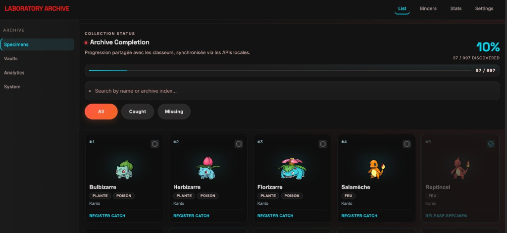
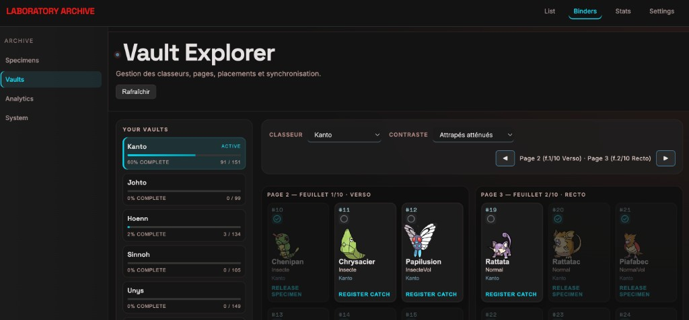
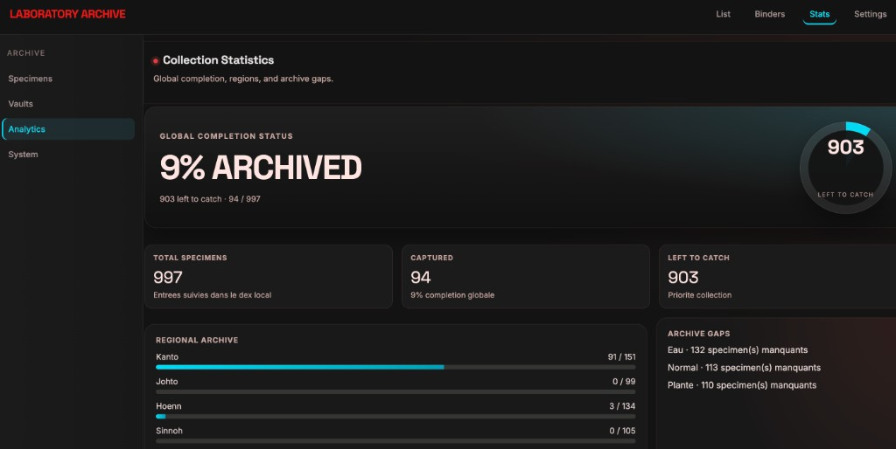

# pokevault

[](https://www.python.org/downloads/)
[](LICENSE)
[](#quality)
[](CHANGELOG.md)

<p align="center">
  
</p>

**Le Pokédex des collectionneurs qui préfèrent les vrais échanges au cloud.**

**pokevault** is a local-first Pokemon collection tracker for exploring a
Pokedex, meeting other Trainers through exchanged local cards, and organizing
physical binders, badges and printable checklists.

No account. No cloud database. No hosted live demo yet. Run it locally and keep
your collection data in readable JSON files.

The app and landing page open in French by default, with a lightweight FR/EN
switch for collectors who prefer the interface in English. The switch is local
only and does not add accounts, services or dependencies.

Think of it as a private field notebook for the old Pokemon loop: explore route
after route, note what you found, meet other Trainers, and complete your Pokedex
without giving the journey to a hosted tracker.

<p align="center">
  
</p>

## Links

- [Project site](https://boblebol.github.io/pokevault/)
- App documentation: run `make dev`, then open `#/docs` in the local app
- [Release notes](CHANGELOG.md)
- [Roadmap](docs/ROADMAP.md)
- [V1.1 Pokédex-first tickets](docs/V1_1_POKEDEX_FIRST.md)
- [Postponed ideas](docs/POSTPONED.md)
- [Design system](DESIGN.md)
- [Contributing](CONTRIBUTING.md)
- [Release process](RELEASING.md)
- [Security policy](SECURITY.md)

## Developer Quick Start

Requirements:

- Python 3.11+
- [uv](https://github.com/astral-sh/uv)

```bash
git clone https://github.com/Boblebol/pokevault.git
cd pokevault
make install
make dev
```

Open the local app at [http://127.0.0.1:8765](http://127.0.0.1:8765/).

The reference `data/pokedex.json` is shipped with the repository, so the UI
works immediately after install. Optional artwork caches are generated locally.

## Product Documentation

App documentation: Detailed product documentation lives in the app. Run `make dev`, open
[http://127.0.0.1:8765](http://127.0.0.1:8765/) and go to `#/docs`.

That in-app guide is bilingual FR/EN and covers Collection, physical binder
planning, Trainer Cards, badge progress, local-first data files, backups,
shortcuts and the local REST API. The public feature overview is
available at [docs/features.html](docs/features.html).

Pokemon details open in one modal across the app. That modal keeps capture
actions, forms, notes, type matchups and game Pokedex appearances from
`data/game-pokedexes.json` in the same place.

Product coverage includes a badge gallery with sealed badges in Stats and the
nostalgia catalog: Souvenirs de Kanto for Rouge/Bleu champions d'arene,
Conseil 4, Maitre de la Ligue and rival teams; Or/Argent for Johto, Kanto,
Peter and Silver; then base teams sans remakes from Rubis/Saphir,
Diamant/Perle, Noir/Blanc, Noir 2/Blanc 2, X/Y, Soleil/Lune, Epee/Bouclier and
Ecarlate/Violet.

Pokevault is an unofficial fan project. It is not affiliated with Nintendo,
The Pokémon Company, Game Freak, Creatures, Poképédia or the Pokémon brand.

## Why Pokevault Exists

Pokevault tries to keep the nostalgic rhythm of older Pokemon versions without
copying their constraints: you explore your own collection, capture what you
have, spot what is still missing, meet other Trainers through files they chose
to send, and complete your Pokedex
at your pace.

The modern part is deliberately quiet. Your data stays local-first, the Dresseurs
layer is optional, and exchanges remain manual instead of becoming a hosted
social feed.

## Local Trainer Card Exchange

Trainer Cards are a manual file exchange, not a social network. You create your
own card from the `Dresseurs` tab, export it, and send that file through any
channel you already use. Another collector can do the same, and you import their
file into your searchable local contact book.

The exchange model stays close to the Pokedex:

- missing Pokemon are implicit: if you have not captured it, you are still
  looking for it;
- `Capturé` marks Pokemon already in your collection;
- `Double` marks Pokemon you own twice and can offer for trade;
- `Relâcher 1` removes the duplicate copy and keeps the Pokemon captured;
- `Relâcher` removes the last captured copy from local progress.
- Contact lines can share Instagram, Facebook, phone, email, Discord or site
  details inside the exported card file.
- Trainer Cards share only `Double` entries. They do not publish a wishlist or
  badge list.
- Imported cards can add `Vu chez` when another trainer has a duplicate you have
  not captured yet.

Trainer Cards never sync automatically and never overwrite collection progress.
The full guide lives in [Trainer Cards](docs/TRAINER_CONTACTS.md).

## Physical Binder Layouts

The binder tab keeps the base workflow automatic: without any settings, it
creates regional binders in the classic 3×3 · 10 sheets (`10 feuillets`) format.
A feuillet is treated like a real plastic sheet with recto and verso, so
capacity is:

`rows × columns × feuillets × 2`

Collectors who use smaller or larger binders can open
`Classeurs > Modifier format`, choose a preset or custom grid, and regenerate
the local binder view. The same settings control rows, columns and the number of
physical sheets. If a region is too large for the selected format, Pokevault
keeps every Pokemon visible by splitting that region into numbered binders such
as Kanto 1 and Kanto 2 instead of hiding entries.

`Grand classeur 3x3` is the large ring binder mode for collectors who want one
physical binder instead of one binder per region. It keeps the 3×3 front/back
sheets model, groups entries into internal region sections, starts each region
on a new sheet front (recto), compacts evolution families within that region,
keeps regional forms in their form region, and auto-calculates the needed sheet
count with 10 spare sheets.

Generation sprites are available from `Réglages > Images / sprites`. Print can
also choose its own image mode, so a collector can print retro sprites without
changing the main collection view.

The optional `Familles` organization uses `data/evolution-families.json` to keep
evolution stages readable while saving space. Short complete families can share
a 3×3 row, for example Spoink / Groret / Spinda. Branches keep their readable
shape: Ptitard / Têtarte / Tartard stay together, Tarpaud starts the next row,
and generated trailing alignment gaps are not printed. The layout engine marks
those generated fillers as `alignment_empty`; intentional family reservations use
`family_reserved` and remain printable. Manual corrections stay in
`data/evolution-family-overrides.json`, so the app UI does not expose
expert-only layout controls.

Printable small binder cards live under
`Impression > Regrouper par > Petites fiches classeur` (`Print > Group by > Small binder cards`
in English). They print Pokemon slots, and intentional family reservations still print as temporary placeholders.
Ordinary capacity slots and alignment empties (`vides discrets`) are skipped.

## Screenshots

<table>
  <tr>
    <td><strong>Binder planning</strong><br></td>
    <td><strong>Collection statistics</strong><br></td>
  </tr>
</table>

## Common Commands

```bash
make              # Show available commands
make install      # Install dependencies
make dev          # Start local server
make open         # Open local web UI
make fetch        # Full Pokepedia scrape
make fetch-test   # Small scrape for development
make fetch-evolutions # Generate evolution-family binder layout data
make check        # Lint + tests + tracker coverage + web tests
make docker-up    # Pull and start the published Docker image
make docker-up-local # Build this checkout and start it
make docker-down  # Stop docker compose
```

## Data Model

Only reference data is versioned:

- `data/pokedex.json`
- `data/narrative-tags.json`
- `data/evolution-families.json`
- `data/evolution-family-overrides.json`
- `data/game-pokedexes.json`

User state is local and ignored by Git:

- `data/collection-progress.json`
- `data/binder-config.json`
- `data/binder-placements.json`
- `data/trainer-contacts.json`

Older installs may still have `data/hunts.json` from the explicit search-list
workflow. The simplified capture/trade model treats that file as legacy local
state: it is ignored by the active app and omitted from new backups.

Older installs may also still have the removed physical Pokemon card catalog
file. The current app ignores that legacy local file, omits it from new backups,
and keeps Pokemon card collection management outside the active scope.

Older progress files may also contain removed `first_encounter` badge ids. Those
ids are cleaned/ignored during active reads and imports; the badge gallery
remains available for current progressive unlocks and Stats.

## REST API

The local API is mounted next to the web UI:

| Endpoint | Purpose |
|----------|---------|
| `/api/health` | App/API version and liveness |
| `/api/progress` | Collection progress |
| `/api/badges` | Badge catalog and progress |
| `/api/trainers` | Optional local Trainer Cards and received contacts |
| `/api/binder/*` | Binder configuration and placements |
| `/data/game-pokedexes.json` | Game Pokedex definitions and known appearances |
| `/api/export` | Full backup export |
| `/api/import` | Full backup restore |

Trainer Cards are separate from full backups and never sync automatically.
`Double` marks a Pokemon as available in your exported Trainer Card. Missing
Pokemon stay implicit, so imported cards only need to show `Vu chez` when another
trainer has a duplicate you still need. See [Trainer Cards](docs/TRAINER_CONTACTS.md)
for the local exchange guide.

## Docker

```bash
make docker-up       # Pull ghcr.io/boblebol/pokevault:latest and start it
make docker-up-local # Build this checkout as pokevault:local and start it
```

The container serves the app on [http://127.0.0.1:8765](http://127.0.0.1:8765/)
and mounts `./data` for local persistence. `make docker-up` does not build from
the local checkout, so it avoids the Python base-image pull during everyday
startup. Override `DOCKER_TAG` to pin a release, or `DOCKER_PLATFORM` to force a
Docker platform.

## Project Site

The static GitHub Pages source lives under [docs/](docs/). It is a zero-build
site checked into the repository. There is no public hosted demo URL at the
moment; use the local app for testing.

## Quality

The `tracker/` package is kept at 100% line coverage.

```bash
make check
```

CI runs lint, coverage, web tests and Docker build checks on pull requests.

## Release Notes

See [CHANGELOG.md](CHANGELOG.md) for the current release history.

## License

[MIT](LICENSE)
